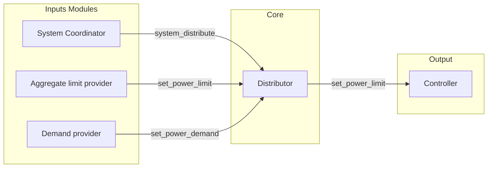
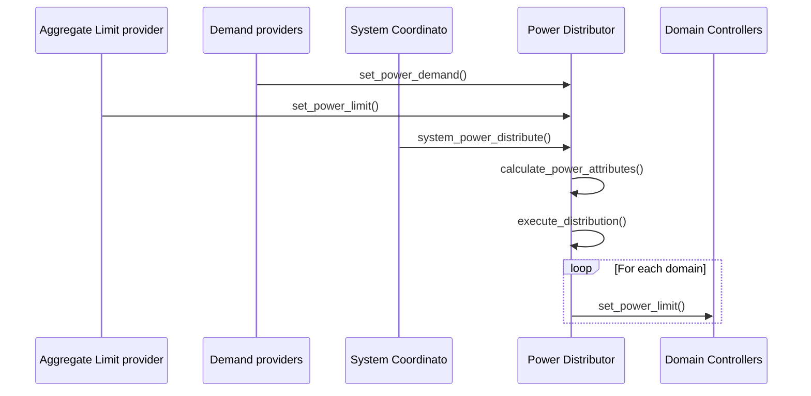

\ingroup GroupModules Modules
\defgroup GroupPowerDistributor Power Distributor service

# Power Distributor

Copyright (c) 2025, Arm Limited and Contributors. All rights reserved.

## Overview

The Power Distributor module in the Arm SCP/MCP firmware suite orchestrates the allocation of constrained power 
resources across a hierarchical structure of power domains. This hierarchy, defined through parent-child relationships,
forms a directed tree. 
The current default strategy guarantees equitable power distribution based on each domain's declared demand and
power limit.
It operates under principles of fairness, determinism, and system integrity in embedded power management scenarios.

While this is the default behavior, the framework is architected to support alternative or custom distribution
strategies in future implementations, enabling flexibility for diverse policy and system-level requirements.

---

## Module Design

Designed as a service module, the Power Distributor integrates seamlessly with the SCP/MCP runtime.
It leverages the framework’s infrastructure for module lifecycle management, memory allocation,
and API-based inter-module communication. The core design components include:

- **Domain Context Registry**: Maintains per-domain runtime state including demand, budget, and limit.
- **Hierarchical Tree Constructor**: Represents domain relationships using a directed tree structure for recursive propagation.
- **Aggregate Attribute Evaluator**: Computes demand and limit values bottom-up through the tree's domains.
- **Distribution Engine**: Performs top-down budget allocation using the selected strategy (Default strategy: a deterministic water-filling algorithm).
- **Extensible API Surface**: Enables integration power controllers 
                              through well-defined module interfaces.

**System Architecture Diagram:**



---

## Operation

The data exchange and operational sequence follow a well-defined pipeline 
between metrics analyzer, the power distributor, and controller modules:



---

## API Usage

### Exposed Functional Interfaces

- `system_power_distribute(void)` — Initiates a full-system power allocation cycle.
- `set_power_demand(fwk_id_t id, uint32_t power_demand)` — Reports real-time domain power requirements.
- `set_power_limit(fwk_id_t id, uint32_t power_limit)` — Imposes an upper bound on power allocation per domain.

### Bindable Interfaces for Module Integration

```c
enum mod_power_distributor_api_idx {
    MOD_POWER_DISTRIBUTOR_API_IDX_DISTRIBUTION,
    MOD_POWER_DISTRIBUTOR_API_IDX_POWER_MANAGEMENT,
};
```

These enumerations identify access points for inter-module communication and runtime binding.

---

## Stages semantics

### Initialization Semantics

1. `power_distributor_init()` allocates internal data structures.
2. `power_distributor_element_init()` initializes metadata for each domain.
3. `power_distributor_post_init()` builds the domain tree from static configuration.
4. `power_distributor_bind()` connects domains to their respective controller APIs where possible.

### Distribution Semantics

1. The domain tree is traversed bottom-up to aggregate demands and constraint-aware limits.
2. All budgets are cleared; the root domain receives a budget equal to its limit.
3. A top-down traversal executing the selected parent-children distribution strategy
    - Default strategy is using a two-phase water-filling allocation strategy:
        - **Phase I**: Satisfies base demand, constrained by declared limits.
        - **Phase II**: Allocates remaining capacity.

---

## Configuration Example

Below is a static configuration for a hierarchical system comprising one root domain and two clusters:

```c
static struct mod_power_distributor_domain_config domain_config[] = {
    [0] = {
        .name = "System",
        .parent_idx = MOD_POWER_DISTRIBUTOR_DOMAIN_PARENT_IDX_NONE,
        .controller_id = FWK_ID_ELEMENT_INIT(FWK_MODULE_IDX_CUSTOM_CTRL, 0),
        .controller_api_id = FWK_ID_API_INIT(FWK_MODULE_IDX_CUSTOM_CTRL, 0),
    },
    [1] = {
        .name = "Cluster 0",
        .parent_idx = 0,
        .controller_id = FWK_ID_ELEMENT_INIT(FWK_MODULE_IDX_CUSTOM_CTRL, 1),
        .controller_api_id = FWK_ID_API_INIT(FWK_MODULE_IDX_CUSTOM_CTRL, 0),
    },
    [2] = {
        .name = "Cluster 1",
        .parent_idx = 0,
        .controller_id = FWK_ID_ELEMENT_INIT(FWK_MODULE_IDX_CUSTOM_CTRL, 2),
        .controller_api_id = FWK_ID_API_INIT(FWK_MODULE_IDX_CUSTOM_CTRL, 0),
    },
};
```

This configuration defines a parent-child topology where "System" serves as the root domain.

---

## Notes and Constraints

- The system mandates a singular root node to ensure consistent and deterministic traversal.
- Power computations are performed using overflow-safe arithmetic to ensure correctness.
- The traversal and distribution order is statically determined post-initialization and is immutable at runtime.


## Future expansions:
- Domains priorities
- Mechanism to attach custom distribution strategy
